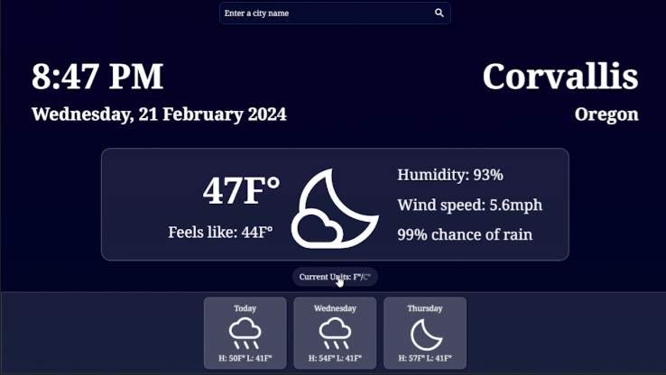
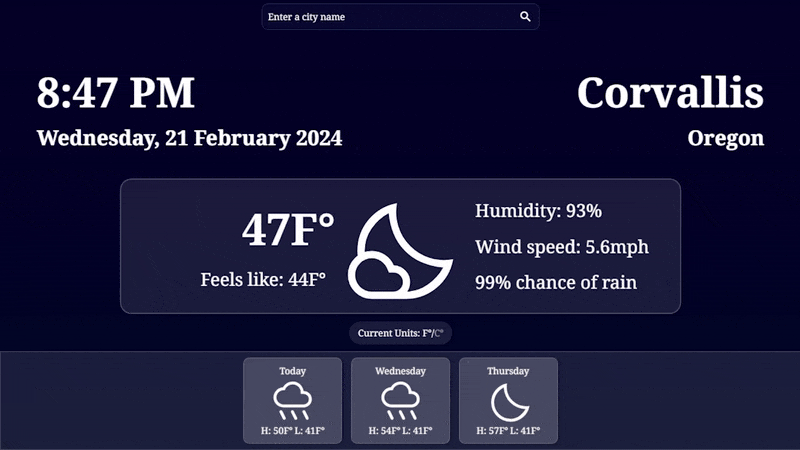
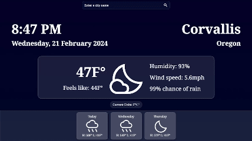

# Weather-App

A live demo of the game can be found [here](https://zando411.github.io/Weather-App/)

## App Features

Fully functioning weather app that gives data about any location in the world! Displays helpful data such as the time, date, temperature, humidity, wind speed, and chance of rain, along with a nice image in the center to indicate weather outside.

Including the ability to dispay units in Fahrenheit or Celsius!

The background also changes gradients based on the time of day in the destination city!

## What I learned

- Working with API's and Fetch requests
- Reading and dynamically rendering JSON data
- Using Async and Await functions
- Dynamically rendering API information
